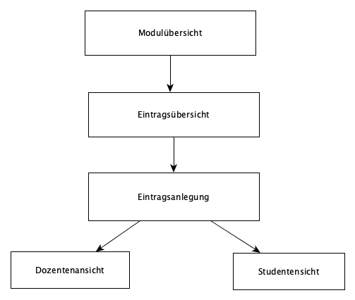

= Dokumentation

== Einführung und Ziele

=== Aufgabenstellung

. Was sind Lernportfolios?

.. Lernportfolios sind digitale Mappen, in denen die Arbeitsprozesse von Studenten festgehalten werden.
.. Sie dienen dazu Studenten über Fehler und Lernprozesse zu reflektieren.
.. Sie dienen als indirektes Feedback für Dozenten.

. Wesentliche Features

.. Vorlagen sind durch Dozenten vorgebbar.
.. Einzelne Journals können aus mehreren Beiträgen bestehen und sind immer einer Veranstaltung zugeordnet.

=== Qualitätsziele

|===

| Qualitätsziel | Erläuterung

| Benutzerfreundlichkeit | intuitives Anlegen von Portfolios

| Übersichtlichkeit | leichtes Zurechtfinden zwischen Einträgen

| Lerneffektivität | über Qualität und Brauchbarkeit des Wissens reflektieren

|===

=== Stakeholder

|===

| Wer ? | Welches Interesse?

| Dozenten | Es kann ein Überblick über die Lernprozesse der Studenten erhalten werden. Daher können Studenten fundiert bewertet werden.

| Studenten | Es kann über die Qualität und Brauchbarkeit des Wissens reflektiert werden. Dadurch wird der Lernerfolg erhöht.

|===

== Randbedingungen

=== Technische Randbedingungen

|===

| Randbedingung | Erläuterung

| Nutzung von JDK 11 | Wir brauchen ein Package, das in JDK 8 nicht funktioniert.

| Einbau von Fremdsoftware | MinIo für Dateiuploads; Keycloak zur Authentifizierung

|===

=== Organisatorische Randbedingungen

|===

| Randbedingung | Erläuterung

| Entwicklung | Nutzung von Intellij; Mockups per Hand

| Testing | JUnit 5 und SpringBoot Tests Version 2.2.5; Checkstyle, PMD, SpotBugs

|===

== Kontextabgrenzung

=== Bestandteile des Systems
. MinIO, damit Anhänge hinzugefügt werden können

=== Externe Systeme und Schnittstelle
. Gruppenbildung, damit Gruppenportfolios möglich sind
. Keycloak: Die Authentifizierung muss eingebunden werden

== Lösungsstrategie
=== Aufbau

=== Integration mit anderen Systemen
==== Gruppenbildung
. Wir stellen einen GetRequest an die Schnittstelle der Gruppenbildung
.. welche Informationen benötigt die Gruppe von uns?
. Gruppenbildung gibt uns ein JSONObject zurück, dass eine Statusid und die Gruppe enthält.

==== Keycloak
. Die Authentifizierung wird hierüber gemacht.
. `application.properties`, sowie `KeycloakConfig` und `SecurityConfig` haben wir aus der "Keycloak Demo" übernommen.
. Die `application.properties` haben wir auf unser Projekt angepasst.

== Entscheidungen / Probleme

=== Bei der Integration

==== Gruppenbildung

. Wir hatten erst einmal Probleme das "realm" zu finden.
. HttpEntity hat nicht funktioniert, daher haben wir uns entschieden ResponseEntity zu nutzen.
. Wir haben erneut mit der Gruppenbildung (gruppen2) geredet und wissen nun in welcher Form wir die Daten bekommen und an welche url wir die Anfrage senden müssen. Dadurch konnten wir die Platzhalter ersetzen.
. Wir wollten "members" aus dem JSON Objekt von Gruppenbildung rausholen. Das hat nicht funktioniert. Uns ist erst später aufgefallen, dass das nicht nötig ist.
. Gruppenbildung hat ihre URL wieder verändert gehabt. Dadurch war es problematisch auf die Seite zuzugreifen.

==== Security

. Wir haben lange nicht verstanden, wie die Ids in Keyclaok gespeichert sind.
. Wir haben die `application.properties` an die Keycloak Clients angepasst.
. Die Zuordnung von Portfolios zu Usern beziehungsweise Gruppen erfolgt nun über die Repositories.Vorher hatten wir eigene Methoden dafür geschrieben. Die Zuweisung über die Repositories ist jedoch verständlicher und weniger fehleranfällig.

==== Datenbank Update Service
. Da wir das genaue Format, das wir von der Gruppenbildung erhalten werden, noch nicht kennen,
konnten wir nur ein Gerüst entwickeln. Bislang ist nur bekannt, dass wir JSON verwenden werden.
. Die `processUpdates` Methode hat anfangs nicht funktioniert. Das lag daran, dass wir das GroupRepository mit `Autowired` annotiert hatten. Wir brauchten allerdings eine `final @NonNull` Deklaration.

=== Beim Bau des Frontends / der Website
Wichtig: Wenn "spring.jpa.hibernate.ddl-auto" in application.properties auf "update" gesetzt ist, muss man vor dem Ausführen des Programms den docker-container neu starten. Wir empfehlen die Property auf "create" zu setzten. Dann tritt dieses Problem nicht auf.

. In unserem Mock haben wir Bootstrap verwendet, um neue Elemente anzeigen zu lassen. Dabei traten Probleme auf, was für uns ein Hinweis war, dass wir unser Design vereinfachen sollten.
.. Am Ende des Projektes hatten wir es geschafft, die grundlegenden Design-Idee umzusetzten, aber unsere Umsetzung, in der das Laden eines neuen Eintrages das Laden einer neuen Seite bedeutet, ist stabiler und Fehlern gegenüber robust.
. Eine weitere Problematik war, dass wir zum Teil komplizierte Thymeleaf-Logik verwenden, um den Inhalt richtig anzeigen zu können;
.. Hier war für uns wichtig, klare Grenzen zwischen Dozenten und Studenten zu zeihen. Um dafür zu sorgen, dass die Logik dieser User Gruppen klar getrennt ist, haben wir uns dafür entschieden für beide Gruppen separate HTML Dateien und Controller Klassen zu schrieben.
.. Thymeleaf war auch sehr nützlich für uns Fehler in unseren Controllern bzw. Service Klassen zu finden, da die kleinsten Fehler oder vergessenen Annotationen dafür sorgten, dass das Frontend nicht funktioniert.
. Nachdem wir mit der Darstellung der Profolios fertig waren, wandten wir uns den Einträgen zu. Hier hatten wir das Problem, dass wir nicht nur Textfelder, sondern unter anderem auch Single & Multiple Choice Felder mit liefern wollten. Um dies zu implementieren, haben wir:
.. Thymeleaf verwendt um die Darstellung des Fields auf der Webseite dem Field-Typ anzupassen.
.. Mehrere Update Funktionen geschrieben, um die Geschäftslogik für die unterschiedlichen Felder zu implementieren.
. Das heißt zwar, dass das Hinzufügen von neuen, bisher nicht implementierten Feld-Typen etwas aufwändig ist, da man vermutlich auch eine Update Funktion schreiben muss, aber wir hielten unseren Lösungsansatz für sinnvoller, da wir so eine klarere Trennung im Code haben, was u.a. das Troubleshooting einfacher gemacht hat.
. Wir haben folgende Feld-Typen Implementiert:
.. Textfelder
.. Single-Choice Auswahl Felder
.. Mulitple-Choice Auswahl Felder
.. Range-Slider Felder
.. Data-Upload Felder
... Hier auch Bilder
. Zu den Auswahl-Feldern: Uns ist in den letzten Stunden der Arbeit am Projekt aufgefallen, dass unsere Implementierung nicht richtig funktioniert: Wir hatten die Values der Buttons als Liste an den Controller weitergegeben. Wir waren davon ausgegangen, dass wir eine Liste der Form {,checked,,} erhalten. Also; zweiter von vier Buttons ist gecheckt worden, also erhalten wir, wenn wir auf dieser Liste .split(",") aufrufen ein String-Array der Form {null, "checked", null, null} erhalten. Tatsächlich erhielten wir folgende Liste {"checked"}. Da wir davon ausgegangen waren, wir würde einen Wert für alle Buttons erhalten und dann über die Liste iterieren, erhielten wir einen Bug, der dafür sorgte, dass wir, unabhängig von der Auswahl, bei x ausgewählten Buttons immer die x ersten Buttons gecheckt hatten. Um dies zu lösen, ersetzten wir den Wert der Buttons durch den "Namen" des Buttons und überprüfen dann, welche Namen im der erhaltenen Liste enthalten sind.

=== Beim Test
. Der Test `AccessRestriction` hat mit einem einfachen MockUser nicht funktioniert. Wir wurden dann durch ein 'TodayILearned' in Rocketchat auf `WithMockKeycloakAuth` aufmerksam.
.. Bei dem Einbau der dependency gab es Probleme, da wir JDK8 genutzt haben.
.. Wir sind dann auf JDK11 umgestiegen. Damit lief der Test durch. Die Applikation funktionierte weiterhin.
.. Gradle build funktionierte lokal, aber nicht beim push in github. Daher haben wir noch die github actions in JDK11 geändert.
. Beim Datenbank Update Service
.. JUnit 5 nutzt anscheinend kein `@Test(expected = Exception.class)` mehr, sodass wir nach Alternativen suchen mussten.
So nutzen wir jetzt `Asserions.assertThrows`.
. Zum Testen des HttpClient haben wir uns entschieden, einen Interface und FakeHttpClient zu nutzen.
Der Response des Clients ist sofort schon die Response Body, wie wir später bemerkten.
. Auf private Felder einer Klasse kann man im Test leider nicht zugreifen.
Das Nutzen von `manifold.ext.api.Jailbreak` hilft auch nicht.
Wir haben das Problem gelöst, indem wir Felder und Methoden package-private eingestellt haben.
. Beim Testen müssen wir teilweise auch auf die Logeinträge achten.
Dazu mussten wir diese in einer Liste speichern.
. Wir haben uns entschieden, keinen Test für den Accountservice zu schreiben. Es wird kaum Logik genutzt, so dass es sich um einen Test handeln würde, der Implementierungsdetails testet.
. Wir haben häufiger `NullPointerExceptions` beim Testen bekommen.
.. Teilweise lag es daran, dass wir diese nicht abgefangen haben.
.. Sonst war häufiger das Problem die richtigen Sachen zu mocken und bei allem daran zu denken, dass man mit `when(...).thenReturn(...)` arbeiten muss.

== Datenbankdesign

image::DB-Diagramm%20vereinfacht.PNG[]

=== Entities

==== Portfolio
Die Portfolio-Entity stellt ein gesamtes Portfolio in der Datenbank dar.
Es soll entweder einer UserId oder eine GruppenId in den entsprechenden Feldern gespeichert werden, je nachdem, ob es sich um ein Gruppen- oder Userportfolio handelt.
Durch den boolean-Wert isTemplate wird festgelegt, ob es sich um eine Vorlage handelt, oder um ein echtes Portfolio.
Durch eine Collection von Entries wird eine One-To-Many Relation mit der Entry-Entity erzeugt. So können zu jedem Portfolio beliebig viele Einträge in der Datenbank gespeichert werden.

==== Entry
Die Entry-Entity stellt einen einzelnen Eintrag in einem Portfolio dar und sollen einen Rahmen darstellen, in dem der eigentliche Inhalt der Einträge gespeichert wird. 
Dieser Inhalt wird dann in den EntryFields gespeichert, zu denen die Entry-Entity eine One-To-Many-Relation hat (siehe EntryField). 
Jedem Entry gehört immer auch zu einem Portfolio, und pro Portfolio können beliebig viele Einträge gespeichert werden.
Außerdem wird in jedem Entry sowohl das Datum der Erstellung, als auch das Datum, an dem er zuletzt bearbeitet wurde, gespeichert.

==== EntryField
Entry-Fields stellen die einzelnen Fragen in einem Portfolioeintrag dar und beinhalten einen Titel, in dem die Fragestellung formuliert werden soll, den Inhalt, in dem die Antwort gespeichert wird, und die Möglichkeit, einen Anhang zu speichern.

==== Group
Die Group-Entity stellt in der Datenbank die Gruppen dar, die unserem Modul vom Gruppenbildungs-Modul übergeben werden. 
Gruppen haben eine id, die in Form eines Longs gespeichert wird, einen Namen (title) und eine Liste von Nutzern. Zwischen Group und User besteht eine Many-To-Many-Relation, zwischen Group und Portfolio besteht eine One-To-Many-Relation

==== User
Die User-Entity stellt einen einzelnen Nutzer in unserer Datenbank dar.
Nutzer können in beliebig vielen Gruppen sein und beliebig viele Portfolios anlegen.
Es wird in der Entity nur ein Username gespeichert, der einem einzigartigen Namen in Keycloak entspricht.

==== State
Der State speichert eine Versionsnummer der Daten in der Gruppen-Tabelle für die Synchronisation mit dem Gruppenbildungs-Modul. Die Versionsnummer wird im Attribut lastState gespeichert. Es bestehen keine Relationen zu anderen Entitäten.

== Qualitätsszenarien

